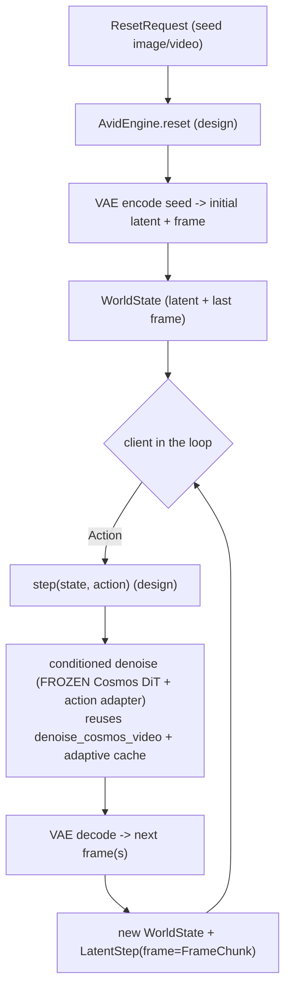

# Part 0 — Orientation: the pixel world model on the same seam

> Reminder (see the [index](README.md)): this is a **design** walkthrough. AVID
> isn't built — it's ADR-0008 Phase 3. Real Repercep pieces get `file:line`;
> AVID-specific pieces are marked **(design)**.

The [V-JEPA 2-AC series](../walkthroughs-vjepa2-ac/) built a world model that
predicts the next *embedding* and plans by energy. **AVID is the same idea in
pixel space:** step the world with an action, but each step produces an actual
*frame* — by running a (cached) **conditioned denoise** of a frozen video
diffusion model. Two world-model families, **one `InteractiveWorldModel` seam.**

## 1. The one-paragraph idea

Cosmos is a strong *text→video* prior, but it isn't conditioned on per-step
**actions**, and retraining 7 B parameters is expensive. **AVID** (Action-conditioned
Video Diffusion) **freezes the base video model and trains a small adapter** that
makes its denoising **action-conditioned**, on a modest set of action-labelled
videos — *without touching the base weights*. Roll that adapted denoise forward
chunk-by-chunk, each conditioned on the next action, and you have a **pixel world
model you can drive in a loop** — riding Cosmos's photorealism, paying a denoise
per step (which is exactly why the adaptive cache earns its keep here).

## 2. The design at 10,000 ft



The **frozen Cosmos DiT**, the **denoise loop**, the **adaptive cache**, the
**VAE decode**, and the **`LatentStep.frame`** envelope are all real (the Cosmos
walkthrough). The **action adapter** and the **`AvidEngine`** are the design /
unbuilt part.

## 3. Where it sits among the three paths

| | Cosmos (one-shot) | V-JEPA 2-AC (latent) | **AVID (this design)** |
|---|---|---|---|
| Interaction | prompt → finished clip | closed loop, latent | **closed loop, pixels** |
| Per-step output | — (whole clip) | next embedding | **next frame(s)** via denoise |
| Core compute | denoise the whole volume | tiny block-causal predict | **conditioned denoise per step** |
| Adaptive cache | ✅ the lever | ✗ (no denoise) | **✅ reused** |
| Planning | — | cheap (energy in latent) | expensive (pixels) → likely deferred |
| Base model | trained | trained | **frozen + small trained adapter** |
| Seam | `WorldModelEngine` | `InteractiveWorldModel` | **`InteractiveWorldModel`** (same) |

The takeaway: AVID is the path where Repercep's **diffusion** investment (the loop,
the cache, the FP8 kernels, the VAE) and its **interactive seam** meet. It's the
one world-model family that uses *all* of the existing machinery.

## 4. What's real vs. what's the work

- **Real, reused (exists today):** `InteractiveWorldModel`
  (`runtime/interactive.py`), `denoise_cosmos_video` + the adaptive cache
  (`runtime/denoise.py`), `LatentStep.frame` (`runtime/types.py`), the
  `/v2/world/session` WebSocket (`serving/app.py`), and the attention-dispatch
  seam the action conditioning would hook into (Cosmos walkthrough Part 4).
- **The actual work (design / Phase 3):** the **action adapter** — which must be
  *trained* on action-labelled video for the target domain — and the `AvidEngine`
  class. No amount of plumbing substitutes for the trained adapter; that's the
  honest crux.

## "Run it"

There's nothing to run *for AVID* — it's unbuilt, and pretending otherwise would
be the exact overstatement this project avoids. But the pieces it reuses all run
today:

```bash
# the same interactive seam AVID would implement (latent stub):
python scripts/run_vjepa2_ac.py --stub --plan
# the denoise loop + adaptive cache AVID's step() would reuse (needs a GPU):
#   python scripts/run_cosmos.py --native-loop --cache-mode adaptive ...
# the WebSocket session AVID would serve through:
python -m pytest tests/test_serving_interactive.py -q   # in the [dev] env
```

**Next:** Part 1 — how an adapter makes a frozen video diffusion model
action-conditioned (the ML), and why that beats fine-tuning or a separate latent
model for *this* goal.
