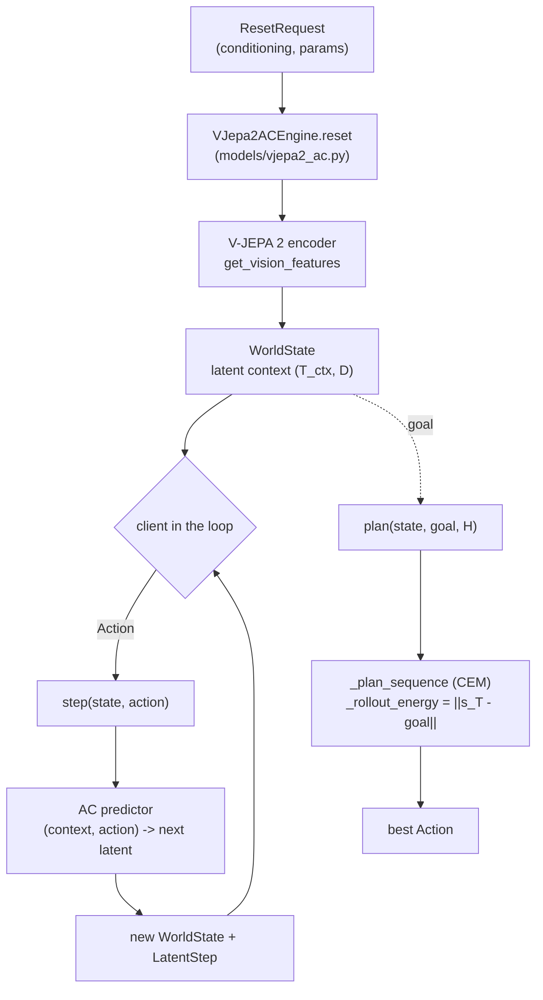

# Part 0 — Orientation: a world model you can step

The Cosmos walkthrough was a *generator*: one prompt in, one finished video out,
produced by iteratively denoising a latent volume. V-JEPA 2-AC is a different
animal — a **world model you drive in a loop**: give it an observation, then feed
it an **action** and it predicts the **next world state**; feed another action,
get the next state; and so on. It never makes pixels — it predicts in **embedding
space** — and it *plans* by **minimizing an energy**. This part lays out what it
is, the call path, and how sharply it differs from the diffusion path.

> Pitch (see the [index](README.md)): full depth on both the ML level (JEPA, the
> energy view) and the systems level (the seam, the rollout, the planner, serving).
> Part 0 is the intuition + the map; Parts 1–4 do the mechanics.

---

## 1. JEPA / energy-based world models, in one page

Three ideas, no heavy math:

1. **Predict in representation space, not pixels (JEPA).** A **Joint-Embedding
   Predictive Architecture** encodes an observation into an embedding, then
   predicts the *embedding* of what comes next — never the raw pixels. Yann
   LeCun's argument: most pixels are unpredictable noise (exact leaf positions,
   texture); forcing a model to render them wastes capacity. Predicting the
   *representation* keeps only what's predictable and useful for planning.
   **V-JEPA 2** is the video instantiation; Repercep already runs its encoder
   (`scripts/run_vjepa2.py`).

2. **It's an energy-based model (EBM).** An EBM learns a scalar **energy**
   `E(x, y)` that is *low* when `y` is a compatible continuation of `x` and
   *high* otherwise. JEPA's energy is just the **prediction error in embedding
   space**: `‖predicted_embedding − actual_embedding‖`. Training pushes that down
   for real pairs (with a non-contrastive trick — an EMA "teacher" — to avoid the
   collapse that would otherwise need the intractable partition function; Part 1).
   No softmax over pixels, no normalization constant.

3. **Action-conditioned ⇒ you can plan.** **V-JEPA 2-AC** (the "AC" = action-
   conditioned, ~300 M params, block-causal) adds an action input: given the
   current state embedding and an action, it predicts the *next* state embedding.
   Stack that into a rollout and you have a **world model for control** — to
   reach a goal, search over action sequences for the one whose predicted rollout
   lands at low energy to the goal embedding. That search **is** model-predictive
   control, and it **is** energy minimization. Part 4 is exactly this.

That's the whole idea: encode → predict-next-embedding-given-action → plan by
minimizing latent energy.

---

## 2. The call path (what actually runs)

The seam is **not** the one-shot `generate()` of the Cosmos path — it's a
stateful loop. Anchors:

| Stage | Where | Note |
|-------|-------|------|
| Seam (Protocol) | `src/repercep/runtime/interactive.py` (`InteractiveWorldModel`) | `reset → step(action) → … / plan` — distinct from `WorldModelEngine` |
| Wire types | `runtime/types.py` (`Action`, `RolloutParams`, `WorldState`, `LatentStep`, `ResetRequest`) | `WorldState` carries the live latent (never crosses the wire, like `Frame`) |
| Engine | `src/repercep/models/vjepa2_ac.py` (`VJepa2ACEngine`) | encoder + AC predictor (injectable; weight load is the port) |
| `reset` | `vjepa2_ac.py` `reset()` | encode the seed observation → initial `WorldState` (latent context) |
| `step` | `vjepa2_ac.py` `step()` | predictor(context, action) → next latent; append to the block-causal window |
| `plan` | `vjepa2_ac.py` `plan()` / `_plan_sequence` / `_rollout_energy` | CEM/MPC: minimize `‖rollout_terminal − goal‖` over action sequences |
| Serving | `serving/app.py` `/v2/world/session` (WebSocket) | bidirectional: client sends `Action`, server returns `LatentStep`, state persists |
| Runner | `scripts/run_vjepa2_ac.py` | `--stub` runs the whole loop + planner on CPU, no weights |



---

## 3. How it differs from the Cosmos diffusion path

This contrast *is* the reason the path exists (it's the regime general-purpose
diffusion servers don't model — see [ADR-0008](../adr/0008-interactive-world-model-seam.md)):

| | Cosmos (diffusion) | V-JEPA 2-AC (JEPA / EBM) |
|---|---|---|
| Interaction | one-shot: prompt → finished clip | **closed loop**: action per step, state persists |
| Output | pixels (VAE decode) | **latent embeddings** (no decode) + an energy |
| Core compute | iterative **denoising** of a latent volume | **autoregressive** next-state prediction (block-causal) |
| Attention | bidirectional, S ≈ 109k | block-causal over a small latent context window |
| The lever | **adaptive cache** (skip denoise steps) | **energy-MPC planning** (no denoise loop → cache N/A) |
| Inference shape | many forwards over one fixed request | feed-forward encode + per-step predict + a search |
| Metric | wall-time per clip | closed-loop latency / steps under state carryover |

If you internalize one thing: **Cosmos asks "what video matches this text?"; V-JEPA
2-AC asks "if I take this action, what happens next — and which actions reach my
goal?"** Same runtime, same `Backend` seam (ADR-0003), very different shape.

---

## 4. What's real here vs. awaiting weights

Be clear-eyed (the index says it too):

- **Real + CPU-tested:** the seam, the rollout (`step`), and the **energy-MPC
  planner**. You can run them *today* — see below.
- **The port:** the real V-JEPA 2 encoder load (HuggingFace) and the AC predictor
  head (`facebookresearch/vjepa2`) are `NotImplementedError` with the intended
  body in their docstrings; they need the checkpoints + a GPU.

So the *algorithm* is fully here and runnable; the *trained weights* are the next
step (Part 5).

---

## Run it (CPU, no weights)

The whole loop + planner runs on a synthetic ("stub") world model — this is the
real seam and the real CEM code, just with a toy linear dynamics standing in for
the trained predictor:

```bash
python scripts/run_vjepa2_ac.py --stub --plan --steps 4
```

Verified output (the planner provably drives the latent energy *down* toward a
random goal):

```
[repercep] backend=cpu dtype=float32 action_dim=4
[repercep] reset: step=0 context=(2, 4)
[repercep] step 1: context=(3, 4)
[repercep] step 2: context=(4, 4)
[repercep] step 3: context=(5, 4)
[repercep] plan: energy 1.763 -> 0.401 (first action dim=4)
```

That `1.763 → 0.401` is energy-based planning working end to end: CEM searched
action sequences and found one whose predicted rollout lands ~4× closer to the
goal embedding. Part 4 dissects exactly how.

---

## What you now know

- V-JEPA 2-AC = **encode → predict next embedding given an action → plan by
  minimizing latent energy** (JEPA, an energy-based model).
- The path is a **stateful loop** (`reset → step → plan`), not a one-shot
  generate — served over a WebSocket, with the latent `WorldState` persisting.
- It contrasts with Cosmos on every axis: latent vs pixels, autoregressive vs
  denoising, planning vs caching.
- The algorithm is real and runs on CPU today; the trained weights are the port.

**Next:** Part 1 — JEPA and energy-based models in depth (the ML foundations:
the energy/compatibility view, the collapse problem and the EMA fix, and why this
is *not* a generative model).
