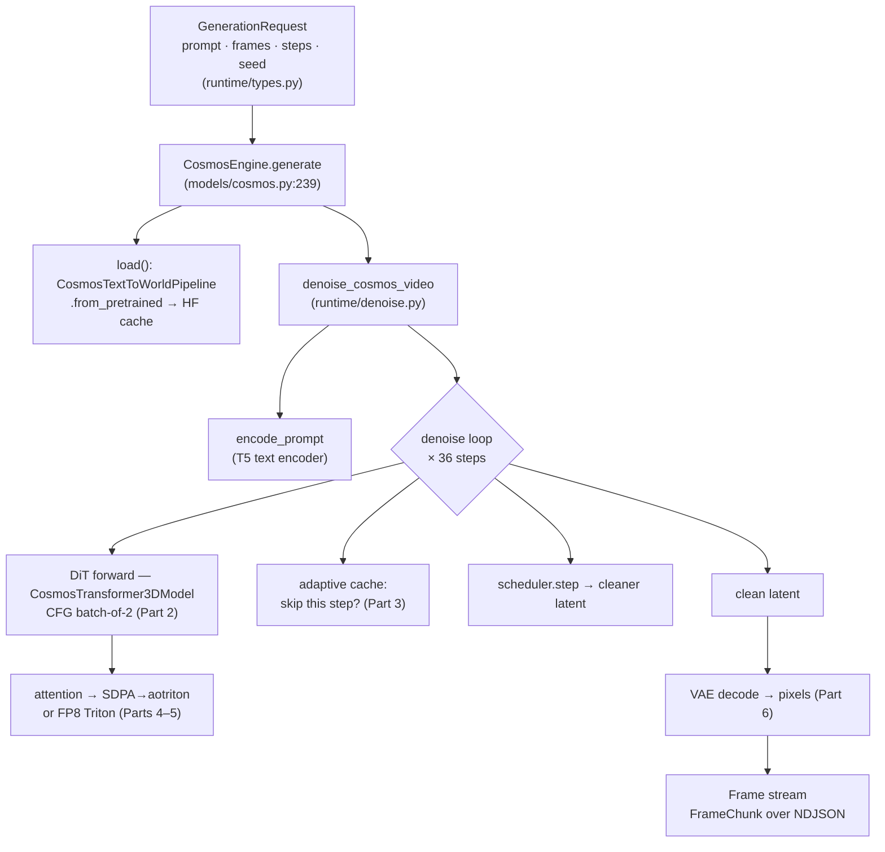

# Part 0 — Orientation: from a prompt to video frames

> **Pitch** (see the [index](README.md)): full depth on **both** the ML/model
> level (diffusion sampling + transformer mechanics, with the math that matters)
> **and** the systems/infra level (execution, memory, dispatch, kernels, ISA).
> This Part 0 is the intuition-level skeleton; Parts 2–5 do the real mechanics.

This part gives you the whole skeleton in one sitting: the fundamentals of what a
video diffusion model *does*, then the exact call path through Repercep from an API
request to streamed frames, with `file:line` anchors you'll revisit in later
parts. Nothing here needs a GPU.

---

## 1. Diffusion video generation, in one page

This is the intuition you need to navigate the call path below; Part 2 does the
real transformer architecture and Part 3 the real sampling mechanics. For now,
the shape of the computation:

1. **Latents, not pixels.** The model never works on raw video. A **VAE encoder**
   compresses video into a much smaller **latent volume** (downsampled in space
   *and* time). All the heavy compute happens in this latent space; a **VAE
   decoder** turns the final latent back into pixels at the very end. (Why: pixels
   are huge — 121×704×1280×3 ≈ 327M numbers; the latent is ~1–2 orders of
   magnitude smaller.)

2. **Generation = iterative denoising.** Start from a latent volume of **pure
   Gaussian noise**. Over **N steps** (Cosmos reference: 36), repeatedly:
   - Show the current noisy latent — plus the **timestep** (how noisy we are) and
     the **text embedding** (the prompt) — to a big transformer, the **DiT**
     (Diffusion Transformer). It predicts which direction is "less noisy."
   - A **scheduler** takes one step in that direction, producing a slightly
     cleaner latent.
   After N steps the latent is clean; decode it to pixels.

3. **The DiT is just a transformer over latent patches.** The latent volume is
   cut into patches → a sequence of tokens. Transformer blocks mix them with
   **self-attention** (tokens attend to each other) and **cross-attention**
   (tokens attend to the text embedding), plus feed-forward layers. The timestep
   conditions the block via **adaLN** (it scales/shifts the activations). This is
   where ~99% of the compute lives — see [F4/F10 in `BUILD_LOG.md`].

4. **CFG (classifier-free guidance).** To make the output follow the prompt
   harder, each step runs the DiT **twice** — once with the prompt, once without —
   and extrapolates between them. That's why a "36-step" run is really ~72 DiT
   forwards (or 36 batched-by-2; Part 3).

5. **The whole optimization game** is: do fewer/cheaper DiT forwards without
   wrecking quality. Repercep's two levers — **adaptive caching** (skip steps whose
   input barely changed) and **FP8 attention kernels** — both attack exactly this.
   Everything in Parts 3–5 is in service of step 2 and 3 above.

That's the entire algorithm. The rest of this tour is *how Repercep executes it*.

---

## 2. The call path (what actually runs)

A request enters at the serving layer, flows through the engine and the denoise
loop, and leaves as a stream of frames. The anchors:

| Stage | Where | Note |
|-------|-------|------|
| Request type | `src/repercep/runtime/types.py` (`GenerationRequest`, `GenerationParams`) | prompt, frames, steps, seed — validated at the edge (Pydantic, `extra="forbid"`) |
| HTTP entry | `src/repercep/serving/app.py:192` (`/v1/generate/stream`) | streams `FrameChunk` as NDJSON; v2 path routes through the Rust core |
| Engine | `src/repercep/models/cosmos.py:239` (`CosmosEngine.generate`) | loads the pipeline, runs the loop, yields `Frame`s |
| Pipeline load | `cosmos.py:149` (`load` → `CosmosTextToWorldPipeline.from_pretrained`) | weights from the HF cache (Part 1) |
| Denoise loop | `src/repercep/runtime/denoise.py` (`denoise_cosmos_video`) | the real loop: CFG batching + adaptive cache (Part 3) |
| DiT forward | diffusers `CosmosTransformer3DModel` (wrapped, not in this repo) | the transformer (Part 2) |
| Attention | `src/repercep/attention/` + `kernels/triton_kernels/` | dispatch + kernel (Parts 4–5) |
| Decode + output | VAE decode → `_as_frame_tensor` (`cosmos.py:403`) → `Frame` | pixels out (Part 6) |

Also: `scripts/run_cosmos.py` is the end-to-end runner you'd actually invoke on a
GPU box.



---

## 3. Where the layers go "down to the kernel"

The phrase "how things get lower to the kernel" maps to a concrete chain we'll
trace in Parts 4–5. A single self-attention inside one DiT block becomes:

```
CosmosTransformer3DModel block
  └─ CosmosAttnProcessor2_0            (diffusers: builds Q,K,V)
       └─ dispatch_attention_fn        (diffusers' attention backend registry)
            ├─ default → torch.nn.functional.scaled_dot_product_attention
            │             └─ on ROCm: aotriton flash kernel   ← the GPU kernel
            └─ REPERCEP_FP8_ATTENTION → Repercep "repercep_fp8" backend
                          └─ FP8 Triton flash kernel           ← kernels/triton_kernels/
                                └─ Triton → LLVM → MFMA (gfx942)  ← the actual ISA
```

The key Repercep insight (and a recurring bug source — F19/F40 in `BUILD_LOG.md`):
the model calls diffusers' *own* dispatcher, not Repercep's attention registry, so
Repercep hooks the kernel in by **registering a backend with diffusers' dispatcher**
(`attention/diffusers_backend.py`) rather than by intercepting the model. Part 4
is entirely about this seam.

---

## 4. Where the weights live (preview of Part 1)

Nothing is in this repo. `from_pretrained("nvidia/Cosmos-1.0-Diffusion-7B-Text2World")`
pulls ~38 GB of weights into the HuggingFace cache (`~/.cache/huggingface/hub/`),
sharded as `*.safetensors`, then memory-maps and places them on the backend's
device in BF16. The pipeline object that comes back is a bundle of four things:
a **T5 text encoder**, the **DiT transformer**, the **VAE**, and a **scheduler**.
Part 1 opens the cache directory, reads the index, and walks the load path.

---

## Run it (CPU, no weights)

You can't run real Cosmos here (no GPU, no weights), but you *can* run the
sibling interactive engine end-to-end on CPU to feel the "load → step loop →
output" shape that Part 3 formalizes:

```bash
python scripts/run_vjepa2_ac.py --stub --plan --steps 4
# prints the rollout (context grows per step) and the energy-MPC planner result
```

And you can read the real loop you're about to study:

```bash
sed -n '64,200p' src/repercep/runtime/denoise.py     # the denoise loop (Part 3)
sed -n '239,304p' src/repercep/models/cosmos.py       # CosmosEngine.generate
```

---

## What you now know

- A generation is **iterative denoising of a latent volume** by a **DiT**, decoded
  by a **VAE**, with **CFG** doubling the per-step work.
- The Repercep path is `request → CosmosEngine.generate → denoise_cosmos_video →
  (DiT forward → attention → kernel) × steps → VAE → Frame stream`.
- "Lowering to the kernel" is `attention processor → diffusers dispatch →
  SDPA/aotriton or FP8 Triton → MFMA`.

**Next:** Part 1 — open the HF cache, read `from_pretrained`, and dissect the four
components of the pipeline.
